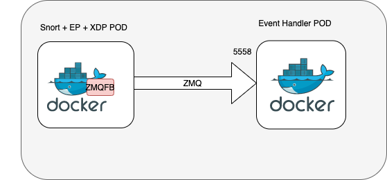

# How to emulate EventHandler ZMQ socket
The following diagram show how we emulate Event handler so we can unit test the new logger plugin
    

## Connect to snort and trigger snort policy deployment

```
kubectl exec -it <snort-pod> -c snort3 -- bash
cd /volume/data/
mv config/ old_config
ln -s /deploy/data/7df302b6-f7ac-4fbb-a3f5-1e0dee433f91/ config
supervisorctl restart snort

wait for deployment to complete "tail -F /tmp/snort-stdout---supervisor-PfzCoO.log"
```

## Connect to eventing container

```
  kubectl exec -it <eventing-pod> -c eventing -- bash
  apt update
  apt-get install vim net-tools python-pip -y
  pip install ipython pyzmq tornado
  copy zmq_test.py to container
  python zmq_test.py 
```

## Trigger IPerf traffic to allow snort to emit events

```
kubectl exec -it iperf3-client-pod -- bash -c 'iperf3 -c $IPERF3_SERVER_SERVICE_HOST -p $IPERF3_SERVER_SERVICE_PORT'
```

## TCP dump commands
- snort container
```
tcpdump -i sneth1 -vvv -nn -s0  dst <eventing POD IP address> && port 5558 && tcp
```
- eventing container
```
tcpdump -i eth0 -nn -s0 -vvv tcp port 5558
```

## Using snort's alerting rule
- create file alert.rules
```
alert tcp (sid:1;)
```
- now start snort as follows
```
snort -Q -v --daq afpacket --daq-dir /usr/local/lib/daq -c /volume/data/config/snort.lua --plugin-path /usr/local/lib/zmqfb -z 1 -j 9000 -m 0x1 --daq-var fanout_type=hash -A zmqfb --lua "zmqfb={tcpsocket='tcp://10.119.243.164:5558',highwatermark=10000, ipv6Enabled=1, send_timeout_ms=1000}" -R alert.rules
```
